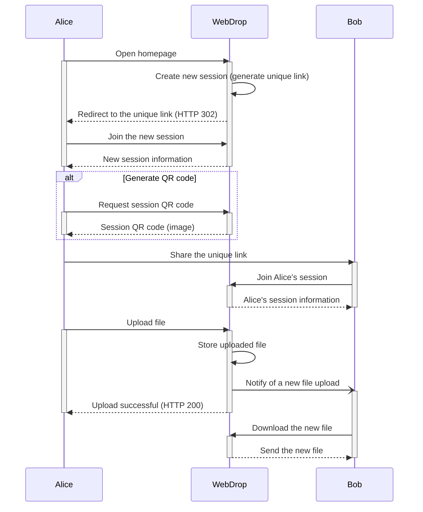

# WebDrop - Easily share files over the web

```mermaid
sequenceDiagram

Alice ->> WebDrop : Open homepage
activate Alice
activate WebDrop
WebDrop ->> WebDrop : Create new session (generate unique link)
WebDrop -->> Alice : Redirect to the unique link (HTTP 302)
Alice ->> WebDrop : Join the new session
WebDrop -->> Alice : New session information
deactivate WebDrop
deactivate Alice

alt Generate QR code
Alice ->> WebDrop : Request session QR code
activate Alice
activate WebDrop
WebDrop -->> Alice : Session QR code (image)
deactivate WebDrop
deactivate Alice
end

Alice ->> Bob : Share the unique link
activate Bob
Bob ->> WebDrop : Join Alice's session
activate WebDrop
WebDrop -->> Bob : Alice's session information
deactivate WebDrop
deactivate Bob

Alice ->> WebDrop : Upload file
activate Alice
activate WebDrop
WebDrop ->> WebDrop : Store uploaded file
WebDrop -) Bob : Notify of a new file upload
activate Bob
WebDrop -->> Alice : Upload successful (HTTP 200)
deactivate WebDrop
deactivate Alice

Bob ->> WebDrop : Download the new file
activate WebDrop
WebDrop -->> Bob : Send the new file
deactivate WebDrop
deactivate Bob
```
